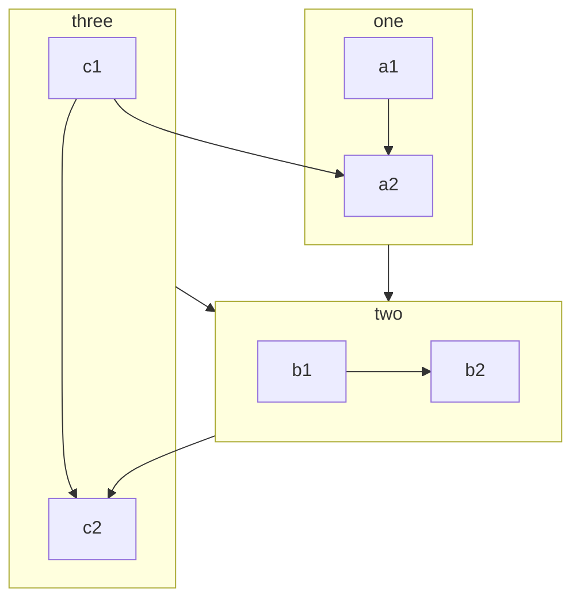

# Badges

# Diagram

```mermaid
flowchart TB
    c1-->a2
    subgraph one
    a1-->a2
    end
    subgraph two
    b1-->b2
    end
    subgraph three
    c1-->c2
    end
    one --> two
    three --> two
    two --> c2
```

# Dependencies

https://depshub.com/features/

# Commit
https://juejin.cn/post/7053730154710827045#heading-10
https://juejin.cn/post/6844904037377114119